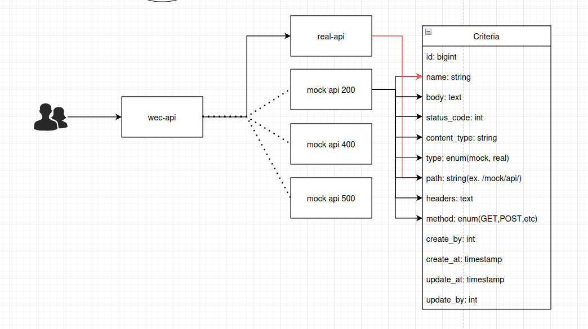

# API Switcher

API Switcher is a Laravel-based tool that allows seamless switching between real API endpoints and mock responses based on defined criteria. It provides a flexible way to develop and test applications without relying on external API services.



> **Note**: API Switcher is designed primarily for development and testing environments to facilitate API mocking and testing.

## Features

- **API Request Routing**: Automatically routes API requests to either real API endpoints or mock responses
- **Custom Criteria Management**: Define custom criteria for different API paths and HTTP methods
- **Mock Response Builder**: Create mock responses with custom status codes, headers, and bodies
- **Real-time API Testing**: Test API endpoints directly from the dashboard
- **Extensive Logging**: Comprehensive logging of API requests, responses, and errors
- **Response Caching**: Cache API responses to improve performance
- **Interactive Dashboard**: Web interface to manage all aspects of API switching
- **Permission-based Access**: Role-based access control for API Switcher functionality

## Installation

### Requirements

- PHP 8.2 or higher
- Laravel 12.0 or higher
- MySQL or compatible database
- Docker (optional, for containerized setup)

### Steps

#### Standard Installation

1. Clone the repository or integrate the API Switcher files into your existing Laravel project
2. Install dependencies:
   ```bash
   composer install
   ```
3. Publish the configuration file:
   ```bash
   php artisan vendor:publish --tag=api-switcher-config
   ```
4. Run migrations to create the required tables:
   ```bash
   php artisan migrate
   ```
5. Set up environment variables in your `.env` file:
   ```
   REAL_API_BASE_URL=https://api.example.com
   API_SWITCHER_ENABLED=true
   API_SWITCHER_DEFAULT=pass
   API_SWITCHER_LOGGING=true
   ```

#### Docker Installation

1. Clone the repository
2. Build and run the Docker container:
   ```bash
   make run
   ```
3. Access the application at the configured URL
4. To access the container shell:
   ```bash
   make shell
   ```

## Configuration

The configuration file is located at `config/api_switcher.php`. Here are the key configuration options:

```php
return [
    // Base URL for the real API
    'real_api_base_url' => env('REAL_API_BASE_URL', 'https://api.example.com'),
    
    // Enable or disable the API switcher
    'enabled' => env('API_SWITCHER_ENABLED', true),
    
    // Default behavior when no matching criteria is found
    // Options: 'real', 'mock', 'pass'
    'default_behavior' => env('API_SWITCHER_DEFAULT', 'pass'),
    
    // Log API requests and responses
    'logging' => [
        'enabled' => env('API_SWITCHER_LOGGING', true),
        'include_request_body' => env('API_SWITCHER_LOG_REQUEST_BODY', false),
        'include_response_body' => env('API_SWITCHER_LOG_RESPONSE_BODY', false),
    ],
    
    // Cache settings for API responses
    'cache' => [
        'enabled' => env('API_SWITCHER_CACHE', false),
        'ttl' => env('API_SWITCHER_CACHE_TTL', 3600), // time in seconds
    ],
    
    // HTTP client settings for real API requests
    'http_client' => [
        'timeout' => env('API_SWITCHER_TIMEOUT', 30),
        'connect_timeout' => env('API_SWITCHER_CONNECT_TIMEOUT', 10),
        'retry' => env('API_SWITCHER_RETRY', 1),
        'retry_delay' => env('API_SWITCHER_RETRY_DELAY', 100),
    ],
    
    // Headers to be forwarded to real API
    'forward_headers' => [
        'Authorization',
        'Content-Type',
        'Accept',
        'X-Requested-With',
    ],
];
```

### Setting Up API Criteria

1. Access the API Switcher dashboard at `/cms-api/api-switcher`
2. Click on "Create New Criteria" to create a new API criterion
3. Fill in the required fields:
   - Name: A descriptive name for the criterion
   - Path: The API path to match (e.g., `/users` or `/products/123`)
   - Method: HTTP method (GET, POST, PUT, PATCH, DELETE, etc.)
   - Type: `real` to forward to real API or `mock` for a mock response
   - Status Code: HTTP status code for mock responses
   - Content Type: Response content type (e.g., `application/json`)
   - Headers: Custom response headers (as JSON)
   - Body: Response body content (as JSON)
   - Is Active: Enable/disable the criterion
   - Description: Optional description of the criterion
   - Real API URL (optional): Override the base URL for this specific endpoint

### Creating a Mock Response

Example of creating a mock response for a user profile endpoint:

1. Create a new API criterion
2. Set Path to `/users/profile`
3. Set Method to `GET`
4. Set Type to `mock`
5. Set Status Code to `200`
6. Set Content Type to `application/json`
7. Set Body to:
   ```json
   {
     "id": 1,
     "name": "John Doe",
     "email": "john@example.com",
     "role": "admin"
   }
   ```
8. Set Is Active to `true`
9. Save the criterion

### Using the API Switcher in Your Code

The API Switcher middleware automatically intercepts API requests based on the configured criteria. No code changes are necessary in your application.

To make requests to endpoints managed by API Switcher, use your regular Laravel HTTP client or any HTTP client of your choice. For example:

```php
// This request will be intercepted by API Switcher if criteria match
$response = Http::get('/api/users/profile');
```

### Testing API Endpoints

The API Switcher dashboard includes a testing tool to test API endpoints and see how they behave with the configured criteria:

1. Navigate to the "Test API Endpoint" section
2. Enter the API path and method
3. Add any required headers or request body
4. Click "Test Endpoint" to see the response

### Viewing API Logs

The API Switcher logs all requests and responses for debugging and auditing:

1. Navigate to the "View Logs" section to see all API activity
2. Filter logs by path, method, status code, etc.
3. View detailed information including request headers, body, and response data

## API Reference

### API Criteria Model

The `ApiCriteria` model is the core component of the API Switcher:

```php
ApiCriteria::findMatchingCriteria(string $path, string $method);
$criteria->isMock();
$criteria->getRealEndpoint();
```

### Middleware Integration

To integrate the API Switcher middleware in additional routes:

```php
Route::prefix('api')->middleware(ApiSwitcherMiddleware::class)->group(function() {
    // Your API routes here
});
```

## Architecture

### Request Flow

1. An API request is received by the Laravel application
2. The `ApiSwitcherMiddleware` intercepts the request
3. The middleware looks for matching criteria in the database
4. Based on the criteria type:
   - If `mock`, returns a mock response with the defined status, headers, and body
   - If `real`, forwards the request to the actual API endpoint
5. If no matching criteria is found, follows the default behavior (pass, mock, or real)
6. Logs the request and response details if logging is enabled

### System Architecture

The API Switcher consists of several key components:

- **ApiCriteria Model**: Defines the criteria for matching API requests and determines their handling
- **ApiSwitcherMiddleware**: Intercepts API requests and processes them according to criteria
- **ApiLog Model**: Records all API activities for debugging and monitoring
- **Dashboard Controllers**: Provide a user interface for managing criteria and viewing logs
- **Configuration System**: Allows customization through environment variables and configuration files

The Docker setup consists of:
- Web container running PHP with Laravel
- MySQL database container
- Optional additional services as defined in `config/docker/compose.yml`

## Troubleshooting

- **API request not being intercepted**: Ensure the API Switcher is enabled in your configuration and that your routes are properly set up with the middleware.
- **Mock responses not working**: Verify the criteria match exactly (path and method) and that the criteria is marked as active.
- **Performance issues**: Consider enabling response caching for frequently accessed endpoints.
- **Headers not forwarded**: Check the `forward_headers` configuration to ensure all required headers are included.

## Security Considerations

- API Switcher should only be enabled in development and testing environments
- Be cautious about storing sensitive data in mock responses
- Use proper authentication for accessing the API Switcher dashboard
- Regular review of API logs to detect potential security issues

## Development

### Docker Commands

The project includes several Docker-related commands in the Makefile:

- `make build-app`: Build the Docker image
- `make network`: Create the Docker network if it doesn't exist
- `make run`: Build and run the Docker containers
- `make logs`: View the container logs
- `make stop`: Stop all containers
- `make shell`: Open a shell in the API container
- `make import-db`: Import database from SQL dump files
- `make build-prod`: Build production Docker image

### Custom Artisan Commands

The API Switcher includes custom Artisan commands for management:

- `php artisan api:list-criteria`: List all defined API criteria
- `php artisan api:check-endpoint {path} {method}`: Check how a specific endpoint would be handled
- `php artisan api:clear-logs`: Clear all API logs
- `php artisan config:set`: Update configuration values

## Contributing

Contributions to the API Switcher are welcome! Please follow these steps:

1. Fork the repository
2. Create a feature branch: `git checkout -b feature/my-feature`
3. Commit your changes: `git commit -am 'Add some feature'`
4. Push to the branch: `git push origin feature/my-feature`
5. Submit a pull request

## License

This project is licensed under the MIT License - see the LICENSE file for details.